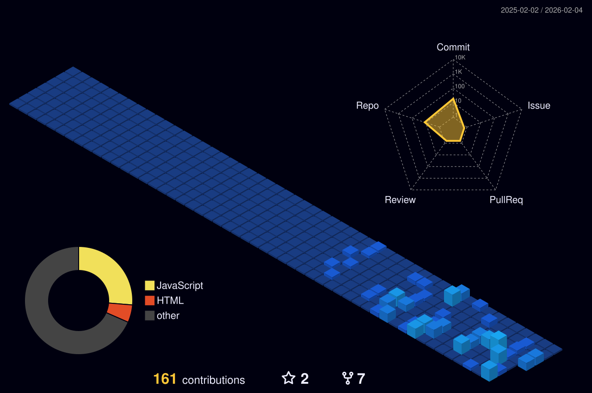

  

  <h3>🚀 Code, Debug, Sleep, Repeat!</h3>

 
  A passionate JavaScript Developer exploring modern web technologies.

  

---

### 👨‍💻 About Me

- 🌍  I'm based in **Bangladesh**
- 🖥️  See my portfolio at [**habibullahasif.vercel.app**](https://habibullahasif.vercel.app/)
- ✉️  **Reach me:** [Facebook](https://facebook.com/asif10h) | [Linkedin](https://www.linkedin.com/in/habibullah-asif/) | [Email](mailto:habibullahasif71@gmail.com)
- 🧠  I'm currently learning **Next.js**
- 👥  I'm looking to collaborate on **React.js & Next.js** projects
- 💬  **Fun fact:** I'm not boring at all! 😄

  
  

---

### 🛠️ Languages and Tools

 

 

 

---

### 📊 GitHub Activity

  

---

### 🏆 Competitive Programming & Problem Solving

  
  
  
  

  
  
  

  
  

---
 ### 🤝 Connect with me

  
  
  
  
  
       
  
  
  

 

  <picture>
    <source media="(prefers-color-scheme: dark)" srcset="https://raw.githubusercontent.com/Asif10H/Asif10H/output/github-contribution-grid-snake-dark.svg" />
    <source media="(prefers-color-scheme: light)" srcset="https://raw.githubusercontent.com/Asif10H/Asif10H/output/github-contribution-grid-snake.svg" />
    
  </picture>

 

  <b>Thank you so much for visiting my tiny space on GitHub! :v:</b>

<!-- 

  

 --> 

